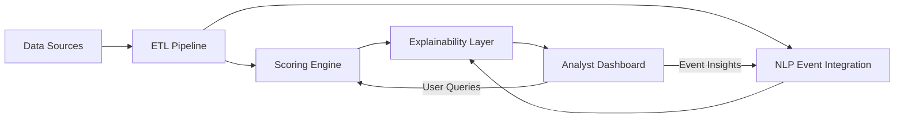

# Explainable Credit Intelligence Platform  
**Real-Time, Transparent, and Evidence-Backed Creditworthiness Scoring**


---

## 📌 Overview  
This repository contains the implementation of the **Explainable Credit Intelligence Platform**, developed for the **CredTech Hackathon** organized by *The Programming Club, IITK* and powered by *Deep Root Investments*.  

Our platform addresses the shortcomings of traditional credit ratings — which are **infrequent, opaque, and lag behind real events** — by providing:  

- **Real-time, dynamic credit scores** for issuers and asset classes  
- **Feature-level explainability** showing why a score changed  
- **Integration of structured and unstructured data sources**  
- **Interactive analyst dashboard** for decision-making  

---

## 🔑 Key Features  

### 1. High-Throughput Data Ingestion  
- Structured sources: Yahoo Finance, Alpha Vantage, World Bank/FRED, SEC EDGAR/MCA filings  
- Unstructured sources: Real-time financial news & press releases  
- Automated **ETL pipeline**: cleaning, normalization, feature extraction  
- Fault tolerance with retries, error queues, and backoff strategies  
- Scalable with schedulers & asynchronous workers  

### 2. Adaptive Scoring Engine  
- Interpretable models: Decision Trees, Gradient Trees with monotonic constraints  
- Post-hoc explainability: SHAP & LIME  
- Granular **issuer and asset-class scores** (1–10 scale)  
- Supports **incremental learning** and frequent retraining  
- Concept drift detection for robustness  

### 3. Explainability Layer  
- **Feature contribution breakdowns**  
- **Short-term vs. long-term trends**  
- **Evidence snippets** from filings & news  
- Plain-language explanations for analysts  
- Strict compliance: explanations map directly to model features (no speculative LLM narratives)  

### 4. Unstructured Event Integration  
- **NLP pipeline**: entity recognition + event classification  
- **Event-to-risk mapping**: quantify impact on leverage, liquidity, growth, etc.  
- Dashboard section: *“Why this score changed”* with links to original sources  
- Example: *“Company X announces debt restructuring → leverage ↑ → credit score ↓”*  

### 5. Analyst Dashboard (Frontend)  
- Real-time widgets: scores, confidence, trend sparklines  
- Interactive filters: issuers, sectors, time windows  
- Alerts for sudden changes & comparison with agency ratings  
- Accessible UI: keyboard navigation & color-blind safe palette  

### 6. Deployment & MLOps  
- **Frontend**: React/Next.js + Tailwind CSS  
- **Backend**: FastAPI (APIs) + Celery workers  
- **Databases**: PostgreSQL (structured), Redis (cache), Elasticsearch (search)  
- **Infrastructure**: Dockerized containers, deployed on Vercel/Render with CI/CD pipelines  
- Automated refresh & retraining supported  

---

## 🌐 Live Demo  
- 🔗 **Deployed App**: [https://demons-credit.vercel.app](https://demons-credit.vercel.app)  
- 🔗 **Submission Form**: [Google Form](https://forms.gle/MDDpymgk9zWYvAdDA)  

---

## 📂 Repository Structure
```
/frontend      → React/Next.js + Tailwind dashboard  
/backend       → FastAPI APIs & scoring engine  
/ingestion     → ETL pipelines for data sources  
/models        → Training, retraining, explainability logic  
/infra         → Docker, CI/CD, deployment configs  
/assets        → Images, demo screenshots  
```

---

## ⚡ Getting Started  

### Prerequisites  
- Python 3.9+  
- Node.js 18+  
- PostgreSQL & Redis  
- Docker (optional, for containerized deployment)  

### Backend Setup  
```bash
cd backend
pip install -r requirements.txt
uvicorn main:app --reload
```

### Frontend Setup  
```bash
cd frontend
npm install
npm run dev
```

Access the dashboard at:  
👉 `http://localhost:3000`

---

## 📊 Example Workflow (Demo Flow)
1. Select an issuer from the search bar.  
2. View the real-time **credit score** and **driving features**.  
3. Drill into the **event feed** for unstructured signals.  
4. Compare score trends against agency benchmarks.  

---

## 🏗️ System Architecture  



---

## ⚖️ Trade-offs & Design Decisions  
- **Decision Trees vs. Deep Models**: prioritized interpretability > marginal accuracy  
- **Free APIs vs. Premium Feeds**: chosen for hackathon feasibility  
- **Batch vs. Streaming**: hybrid approach; frequent updates without overloading APIs  
- **Deployment Platform**: Vercel/Render for simplicity, Docker for reproducibility  

---

## 🚀 Future Improvements  
- Expand unstructured data coverage (transcripts, social sentiment)  
- Add sovereign & sector-level scoring modules  
- Integrate **real-time alerts & notifications**  
- Advanced MLOps: automated retraining + monitoring for concept drift  

---

## 🤝 Team  
**Team Maxwell’s Demons**  
- Built for **CredTech Hackathon 2025**  
- Organized by *The Programming Club, IITK*  
- Powered by *Deep Root Investments*  

---

## 📜 License  
This project is licensed under the MIT License.  

